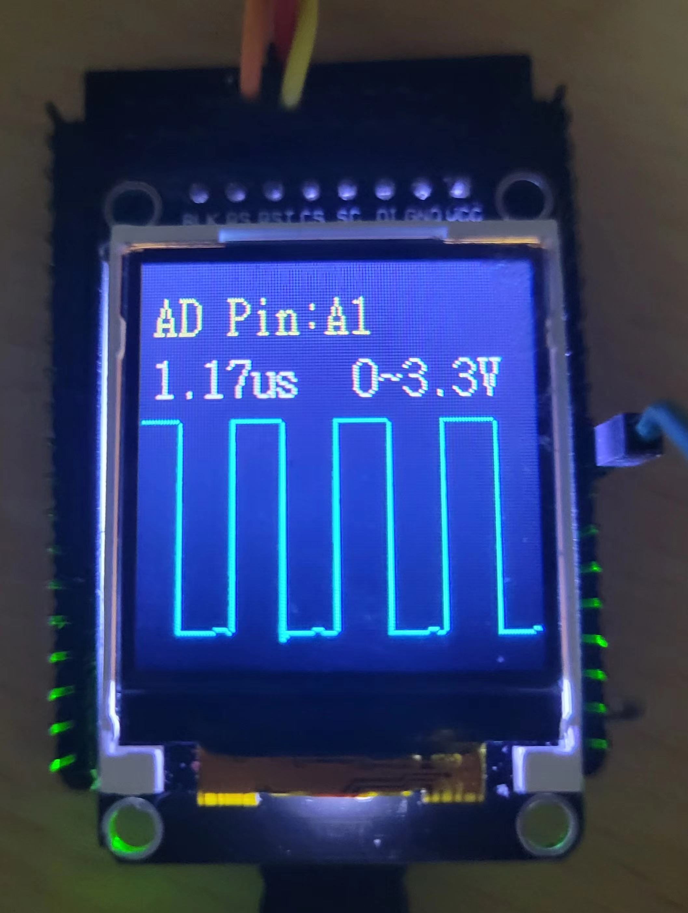

# STM32_Digital_Oscilloscope

本仓库是在 STM32F103C8T6 板上搭配 ST7735R 驱动的 1.44 寸 TFT 显示屏实现的简易数字示波器

总体结构是 GPIOA1 配置为模拟输入模式，作为 STM32 内置 ADC1 的 1 通道进行 AD 采样，采样后的数据通过 DMA 存入数组并触发中断；中断服务函数读取数组并给 TFT 发送指令绘制波形

## Code

比较上层的代码为显示屏驱动 led.c 和具体显示图像的 gui.c

REG 中是对 RCC, GPIO, ADC, DMA 等寄存器的配置，包括

- 用 Systick 实现的延时程序 timer
- 软件模拟的 (只写不读) SPI 协议 softspi
- ADC 和 DMA 的配置 adcor

## Setting

ADC1 配置了 12 MHz 的时钟，显示屏上将显示 127 个采样点的信息

在 adcor.h 中调整 SAMPT 可以改变采样周期，在 STM32 手册的 ADC_SMPR 寄存器部分可以查到三位 SAMPT 与 采样周期的关系，大致为

|SAMPT|采样周期(us)|显示时长(us)|
|---|---|---|
|000|1.17|148.6|
|001|1.67|212.1|
|010|2.17|275.6|
|011|3.42|434.3|
|100|4.50|571.5|
|101|5.67|720.1|
|110|7.00|889.0|
|111|21.0|2667.0|

